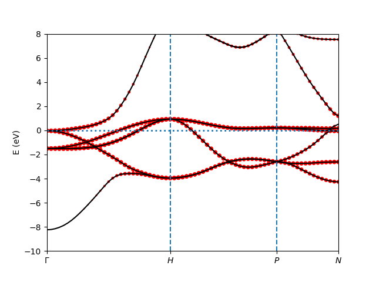
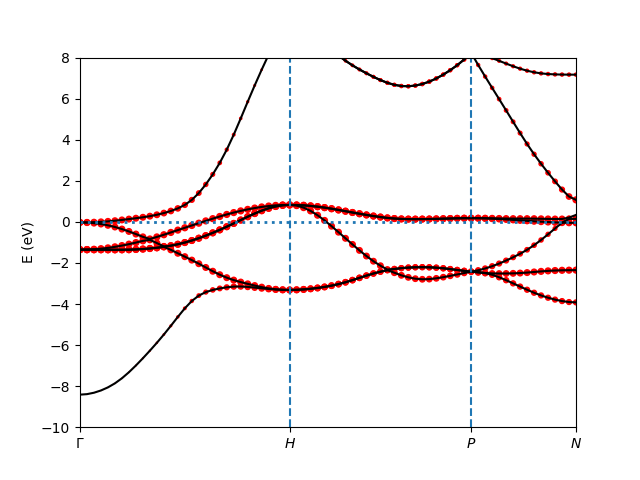
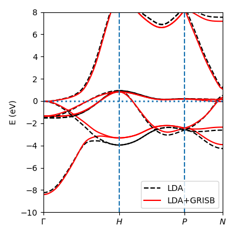
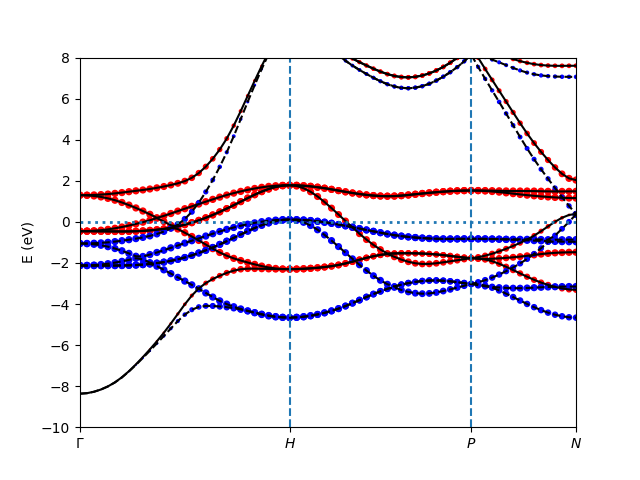

ComRISB calculation of Fe
-------------------------
In this example, we will review the DFT-LDA calculations 
with the FlapwMBPT package, 
using :math:`\alpha`-Fe as an example. 
DFT+GRISB calculations of the paramagnetic (PM) and ferromagnetic (FM) phase 
with ComRISB package will be demonstrated. 

Time for this part: ~60 minutes.

DFT-LDA calculation of Fe
=========================
Starting with the directory *3_Fe*, follow the steps below 
to finish the DFT-LDA calculations. Type::

    $ mkdir -p dft && cd dft
    $ # create files ini, kpath, and kpoints for FlapwMBPT calculation.
    $ ${COMRISB_BIN}/../ComBin/cif2matdelab.py ../bcc.cif -k 3
    $ # create your own job file and submit 
    $ # or directly run FlapwMBPT if convenient.
    $ mpirun -np 2 ${COMRISB_BIN}/rspflapw.exe

After the default 40 iterations, the charge density converges at

*charge density self-consistency= 0.8638399E-08*,

And the DFT-LDA energy reaches 

*dft: ETOT F =     -2541.074138668239    -2541.074855981326*.

DFT+GRISB calculation of PM Fe with zero interaction
====================================================
We will first perform a DFT+GRISB calculation with zero interaction, 
i.e., :math:`U=J=0`. 
The purpose is to demonstrate that it is exactly equivalent to LDA, 
and to facilitate the illustration of correlation effects 
on the spectral function at a later step. 

Changing back to the directory *3_Fe*, follow the steps below
to finish the DFT+GRISB calculations with zero interaction. Type::

    $ mkdir -p dftg/u0j0/lowh && cp bcc.cif dftg/u0j0/lowh/. && cd dftg/u0j0/lowh
    $ ${COMRISB_BIN}/init_grisb.py -u eV -s 1
    $ # -u eV: set internal energy unit to be eV.
    $ # -s 1: set spin z-component order to be -1/2 to 1/2.

Following the screenshot below to specify the GRISB calculation. 
Press `enter`-key to make your choice::

 structure info read from bcc.cif.

 User inputs to initialize G-RISB simulation.
 [?] Break spin-symmetry: no
  > no
    yes

 [?] Break orbital-symmetry: crystal field effect
    no
  > crystal field effect
    full symmetry breaking
 
 [?] Include spin-orbit coupling: no
  > no
    yes
 
 [?] Parametrize Coulomb-matrix: Slater-Condo with [U,J]
  > Slater-Condo with [U,J]
    Slater-Condo with [F0,F2,...]
    Kanamori with [U,J]
    Manual input
 
 [?] Coulomb double counting: FLL dc (updated at charge iter., Rec.)
  > FLL dc (updated at charge iter., Rec.)
    Fix dc potential
    FLL dc self-consistent
    No dc
 
 [?] Solution of embedding Hamiltonian: VTED with Sz symmetry
    Valence truncation ED (VTED)
  > VTED with Sz symmetry
    VTED with S=0
    VTED with Jz symmetry
    ML (kernel-ridge)
    ML (normal-mode-1d)
    DMGR (expt.)
    ML (normal-mode-2d)
    ML (normal-mode-3d)
    HF (debugging only)
 
 Equivalent atom indices:
     [0 0 0 1 1] means 0-2 and 3-4 are two sets of eq. atms.
 [?] Equivalent atom indices: [0]
  > [0]
    modify
 
 
  ------------
  atom 0 Fe
 [?] Is this atom correlated (Y/n):
 [?] Correlated orbital: d
    s
    p
  > d
    f
 
 [?] Enter U J(sep. by space, eV): 0 0
 n_symm_ops = 48 from point-group analysis
            = 48 after screening.
 correlated atom 0 with point group: Oh.
 chi_space 0: 1 equivalent ireps
               (5, 3) basis vectors.
 chi_space 1: 1 equivalent ireps
               (5, 2) basis vectors.

This finishes the manual initialization. 
Alternative ways for initialization will be touched in the next steps.
Two new files are created: *ginit.json* and *GParam.h5*. 
*ginit.json* saves all the information for initialization in json format, 
and *GParam.h5* is an input file for the GRISB calculation in hdf5 format.
One can check the data structure by typing::

    $ h5ls -r GParam.h5

The following information will be displayed on the screen::

 /                        Group
 /impurity_0              Group
 /impurity_0/V2E          Dataset {10, 10, 10, 10}
 /impurity_0/db2sab       Dataset {10, 10}
 /impurity_0/lie_params   Dataset {2, 24, 3}
 /impurity_0/lx           Dataset {10, 10}
 /impurity_0/ly           Dataset {10, 10}
 /impurity_0/lz           Dataset {10, 10}
 /impurity_0/matrix_basis Dataset {2, 10, 10}
 /impurity_0/sx           Dataset {10, 10}
 /impurity_0/sy           Dataset {10, 10}
 /impurity_0/symbol_matrix Dataset {10, 10}
 /impurity_0/symm_operations_3d Dataset {48, 3, 3}
 /impurity_0/symm_operations_csh Dataset {48

Use the followint command to view a specific dataset, 
for instance, the symbolic matrix for local self-energy structure 
simplified due to point group symmetry::

    $ h5dump -d /impurity_0/symbol_matrix GParam.h5

The following information will be displayed on the screen::

 HDF5 "GParam.h5" {
 DATASET "/impurity_0/symbol_matrix" {
    DATATYPE  H5T_STD_I64LE
    DATASPACE  SIMPLE { ( 10, 10 ) / ( 10, 10 ) }
    DATA {
    (0,0): 1, 0, 0, 0, 0, 0, 0, 0, 0, 0,
    (1,0): 0, 1, 0, 0, 0, 0, 0, 0, 0, 0,
    (2,0): 0, 0, 1, 0, 0, 0, 0, 0, 0, 0,
    (3,0): 0, 0, 0, 1, 0, 0, 0, 0, 0, 0,
    (4,0): 0, 0, 0, 0, 1, 0, 0, 0, 0, 0,
    (5,0): 0, 0, 0, 0, 0, 1, 0, 0, 0, 0,
    (6,0): 0, 0, 0, 0, 0, 0, 2, 0, 0, 0,
    (7,0): 0, 0, 0, 0, 0, 0, 0, 2, 0, 0,
    (8,0): 0, 0, 0, 0, 0, 0, 0, 0, 2, 0,
    (9,0): 0, 0, 0, 0, 0, 0, 0, 0, 0, 2
    }
 }
 }

Specifically, here it shows a :math:`e_g-t_{2g}` splitting.

To perform DFT+GRISB calculation, 
an additional input file *comrisb.ini* in text format
is prepared in the upper directory *u0j0*. 
It is a simplified version of *comdmft.ini* for the DMFT calculation 
using ComSUITE package,
which provides information for the construction of wannier interface
by the *ComWann* module.
The *comrisb.ini* reads, in this example, as::

 control={
         'initial_dft_dir': '../../dft/',
         'method': 'lda+risb',
         'mpi_prefix': "mpirun -np 8",
         'max_iter_num_outer': 50,
         'impurity_problem': [[1, 'd']],
         'impurity_problem_equivalence': [1],
         }
 
 wan_hmat={
         'froz_win_min': -10.0,
         'froz_win_max': 10.0,
         }

To run the DFT+GRISB calculation, execute the following command 
or prepare your job script accordingly and submit::

    $ cd ..  # up to u0j0 folder
    $ python3.7 ${COMRISB_BIN}/comrisb.py -c  # -c: continuous run

As expected, the job converges with one iteration. 
The file *convergence.log* records the convergence information::

 i_outer    delta_rho            etot           mu    err_risb       min_z
 ---------  -----------  --------------  -----------  ----------  ----------
        0   0.00000001  -2541.07413883  -0.00000032  0.00000041  0.99999992

The total energy *etot* is the same as DFT-LDA result, 
and the kinetic energy renormalization factor is identity.
The timing information is saved in file *cmd.log*.

Several local quantities of interest are occupations 
for :math:`t_{2g}` and :math:`e_{g}` orbitals, 
which can be obtained from *lowh/GLog.h5* from the dataset */impurity_0/NC_PHY*, 
or search for the last entries of *ncp-renorm* in *lowh/Gutz.log*::

 ************    ncp-renorm  ************
 imp=  1
 real part
   0.6769   0.0000   0.0000   0.0000   0.0000   0.0000   0.0000   0.0000   0.0000   0.0000
   0.0000   0.6769   0.0000   0.0000   0.0000   0.0000   0.0000   0.0000   0.0000   0.0000
   0.0000   0.0000   0.6769   0.0000   0.0000   0.0000   0.0000   0.0000   0.0000   0.0000
   0.0000   0.0000   0.0000   0.6769   0.0000   0.0000   0.0000   0.0000   0.0000   0.0000
   0.0000   0.0000   0.0000   0.0000   0.6769   0.0000   0.0000   0.0000   0.0000   0.0000
   0.0000   0.0000   0.0000   0.0000   0.0000   0.6769   0.0000   0.0000   0.0000   0.0000
   0.0000   0.0000   0.0000   0.0000   0.0000   0.0000   0.5996   0.0000   0.0000   0.0000
   0.0000   0.0000   0.0000   0.0000   0.0000   0.0000   0.0000   0.5996   0.0000   0.0000
   0.0000   0.0000   0.0000   0.0000   0.0000   0.0000   0.0000   0.0000   0.5996   0.0000
   0.0000   0.0000   0.0000   0.0000   0.0000   0.0000   0.0000   0.0000   0.0000   0.5996
   sub_tot=  6.459972  0.000000

Each :math:`t_{2g}` orbital occupies 0.68 electrons, 
and 0.60 for each :math:`e_{g}` orbital., with total 6.46 `3d`-electrons.

The band structure can be obtained by using the following script::

    $ cd lowh && ${COMRISB_BIN}/plot_band_tf.py -el -10 -eh 8 && cd ..

It generates band structure decorated with `3d`-orbital weights.

DFT+GRISB calculation of PM Fe
==============================
One way to set up the calculation is create a new directory *u5j0.8* 
and repeat the above procedure with the correct nonzero interaction parameters.
Here we introduce an alternative easier way by simply modifying the parameters
with provided scripts. Starting with directory *u0j0*, type::

    $ cd ../ && cp -r u0j0 u5j0.8 && cd u5j0.8/lowh/
    $ ${COMRISB_BIN}/switch_gparam.py --unique_u_ev 5 --unique_j_ev 0.8

Now we can start the calculation as previously::

    $ cd ..  # up to u5j0.8 folder
    $ python3.7 ${COMRISB_BIN}/comrisb.py -c

It will take 16 iterations to converge, with the *convergence.log* file::

  i_outer    delta_rho            etot           mu     err_risb       min_z
  -------  -----------  --------------  -----------  -----------  ----------
        0   0.00189709  -2540.91218004   0.06088410   0.00000009  0.81693596
        1   0.00043149  -2540.91474874   0.06088307  -0.00000123  0.81693593
        2   0.00004852  -2540.91473052  -0.01841208   0.00000072  0.81961856
        3   0.00004149  -2540.91421012  -0.05360858  -0.00071526  0.82078603
        4   0.00001536  -2540.91411466  -0.05859637  -0.00000040  0.82093853
        5   0.00000442  -2540.91416410  -0.05392061  -0.00000404  0.82078284
        6   0.00000217  -2540.91421368  -0.05114723  -0.00000065  0.82068645
        7   0.00000129  -2540.91422747  -0.05094792   0.00000524  0.82067366
        8   0.00000077  -2540.91422652  -0.05156255  -0.00000480  0.82070242
        9   0.00000044  -2540.91422601  -0.05202869   0.00000124  0.82071461
       10   0.00000026  -2540.91410120  -0.05186064  -0.00048290  0.82116617
       11   0.00000012  -2540.91421954  -0.05225935  -0.00000312  0.82072632
       12   0.00000007  -2540.91422142  -0.05217349   0.00000491  0.82071604
       13   0.00000004  -2540.91422139  -0.05227547   0.00000274  0.82072138
       14   0.00000002  -2540.91421786  -0.05236450   0.00000157  0.82072514
       15   0.00000001  -2540.91422034  -0.05241289   0.00000587  0.82072286
       16   0.00000001  -2540.91420773  -0.05241025  -0.00000471  0.82072818

The updated local orbital occupations due to correlation can be read 
from the *lowh/Gutz.log* file::

 ************    ncp-renorm  ************
 imp=  1
 real part
   0.6792   0.0000   0.0000   0.0000   0.0000   0.0000   0.0000   0.0000   0.0000   0.0000
   0.0000   0.6792   0.0000   0.0000   0.0000   0.0000   0.0000   0.0000   0.0000   0.0000
   0.0000   0.0000   0.6792   0.0000   0.0000   0.0000   0.0000   0.0000   0.0000   0.0000
   0.0000   0.0000   0.0000   0.6792   0.0000   0.0000   0.0000   0.0000   0.0000   0.0000
   0.0000   0.0000   0.0000   0.0000   0.6792   0.0000   0.0000   0.0000   0.0000   0.0000
   0.0000   0.0000   0.0000   0.0000   0.0000   0.6792   0.0000   0.0000   0.0000   0.0000
   0.0000   0.0000   0.0000   0.0000   0.0000   0.0000   0.5936   0.0000   0.0000   0.0000
   0.0000   0.0000   0.0000   0.0000   0.0000   0.0000   0.0000   0.5936   0.0000   0.0000
   0.0000   0.0000   0.0000   0.0000   0.0000   0.0000   0.0000   0.0000   0.5936   0.0000
   0.0000   0.0000   0.0000   0.0000   0.0000   0.0000   0.0000   0.0000   0.0000   0.5936
   sub_tot=  6.449706  0.000000

In this example, correlation effects introduce very small modification 
to the orbital occupations.

The kinetic energy renormalization matrix :math:`Z=R^\dagger R` 
can be retrieved from *lowh/GLog.h5* as the dataset */impurity_0/R*, 
or from *lowh/Gutz.log* file::

 ************     z-out-sym  ************
 imp=  1
 real part
   0.8799   0.0000   0.0000   0.0000   0.0000   0.0000   0.0000   0.0000   0.0000   0.0000
   0.0000   0.8799   0.0000   0.0000   0.0000   0.0000   0.0000   0.0000   0.0000   0.0000
   0.0000   0.0000   0.8799   0.0000   0.0000   0.0000   0.0000   0.0000   0.0000   0.0000
   0.0000   0.0000   0.0000   0.8799   0.0000   0.0000   0.0000   0.0000   0.0000   0.0000
   0.0000   0.0000   0.0000   0.0000   0.8799   0.0000   0.0000   0.0000   0.0000   0.0000
   0.0000   0.0000   0.0000   0.0000   0.0000   0.8799   0.0000   0.0000   0.0000   0.0000
   0.0000   0.0000   0.0000   0.0000   0.0000   0.0000   0.8207   0.0000   0.0000   0.0000
   0.0000   0.0000   0.0000   0.0000   0.0000   0.0000   0.0000   0.8207   0.0000   0.0000
   0.0000   0.0000   0.0000   0.0000   0.0000   0.0000   0.0000   0.0000   0.8207   0.0000
   0.0000   0.0000   0.0000   0.0000   0.0000   0.0000   0.0000   0.0000   0.0000   0.8207
 imp=  1 eigen values of         z:
    0.8799    0.8799    0.8799    0.8799    0.8799    0.8799    0.8207    0.8207    0.8207    0.8207

The `Z`-factor for :math:`t_{2g}` and :math:`e_g` orbital reduces 
from identity to 0.88 and 0.82 respectively.

The Gutzwiller quasi-particle band structure can be obtained 
by using the same script as previously::

    $ cd lowh && ${COMRISB_BIN}/plot_band_tf.py -el -10 -eh 8 && cd ..

It generates band structure decorated with `3d`-orbital weights.

To contrast the DFT+GRISB band structure of Fe 
with DFT-LDA results obtained earlier, type::
    
    $ cd ../figure1 && python plot.py && cd ../u5j0.8

and one obtained the following figure.

DFT+GRISB calculation of FM Fe with screened interaction
========================================================
In the previous step, we performed a DFT+GRISB calculation for Fe
with interaction parameters `U=5` eV and `J=0.8` eV. 
There another FM solution of lower energy to be explored. 
It can be investigated by a initial guess 
of the GRISB nonlinear equation solution with FM-type spin symmetry breaking.
Note that the exchange-correlation energy is still spin-symmetric LDA, 
the energy gain is therefore purely from the onsite screened interactions.

To prepare the FM calculation, we follow the previous step 
to create a new folder *u5j0.8_fm*. Type::

    $ cd .. && cp -r u5j0.8 u5j0.8_fm && cd u5j0.8_fm/lowh

To introduce an initial guess for the FM solution, 
we rerun the *init_grisb.py* script. 
However, since the file *ginit.json* already exists, 
the script will directly read informatin there 
without explicitly asking any questions.
This will simply regenerate the input file *GParam.h5* 
for PM GRISB calculation.
To introduce spin symmetry breaking, 
one could delete *ginit.json* and answer questions properly 
while running *init_grisb.py*. 
We take another easier route by editing the *ginit.json* file, 
and reinitialize.
Type the fillowing command to replace the value of *1* by *2*
for spin-symmetry breaking::

    $ sed -i 's/"ispin": 1/"ispin": 2/' ginit.json
    $ ${COMRISB_BIN}/init_grisb.py -u eV -s 1 

Further information about how the spin symmetry is to be broken 
needs to be provided through the script *init_magnetism.py*::

    $ ${COMRISB_BIN}/init_magnetism.py

and choose the following as below::

 [?] choose unit used in CyGutz calculation: eV (1)
    Rydberg (13.6)
  > eV (1)
 
 [?] which way to apply vext: initial step only
  > initial step only
    all iterations
 
  total 1 impurities with equivalence indices
  [0]
 
  impurity 0
 [?] enter field direction x y z seperated by space. (e.g., 0 0 1): 0 0 1
 [?] enter b field magnitude (eV/Bohr magneton): 0.3
  maximal symmetrization error of vext = 2.22e-16

Final step for preparation, delete the file *GLog.h5* if present, 
as it save the PM solution::

    $ rm -f GLog.h5

Now the FM calculation can be started as previously::

    $ cd ..  # up to u5j0.8_fm folder
    $ python3.7 ${COMRISB_BIN}/comrisb.py -c

The job converges with 13 iterations. The *convergence.log* reads like::

  i_outer    delta_rho            etot           mu     err_risb       min_z
  --------  -----------  --------------  -----------  -----------  ----------
        0   0.00005456  -2540.93820420  -0.10544984  -0.00000539  0.89580499
        1   0.00001433  -2540.93846530  -0.10545215   0.00000255  0.89580387
        2   0.00000205  -2540.93842080  -0.11472259  -0.00000066  0.89596959
        3   0.00000075  -2540.93837572  -0.11994221  -0.00018106  0.89610887
        4   0.00000053  -2540.93837535  -0.12176499  -0.00000070  0.89607918
        5   0.00000040  -2540.93839476  -0.12246404  -0.00000350  0.89608366
        6   0.00000027  -2540.93840743  -0.12315630  -0.00000035  0.89609038
        7   0.00000016  -2540.93841304  -0.12387580  -0.00000278  0.89609854
        8   0.00000010  -2540.93841516  -0.12449917  -0.00000282  0.89610619
        9   0.00000006  -2540.93841626  -0.12498324  -0.00000048  0.89611241
       10   0.00000004  -2540.93841692  -0.12535097   0.00000165  0.89611723
       11   0.00000002  -2540.93841800  -0.12563217  -0.00000496  0.89611977
       12   0.00000001  -2540.93841819  -0.12585449  -0.00000178  0.89612259
       13   0.00000001  -2540.93841838  -0.12602852  -0.00000106  0.89612503

The total energy reduces from `-2540.9142` Ry in PM phase to `-2540.9384` 
in the FM phasse. The `Z`-factor generally increase with symmetry breaking.
The magnetic moment, as can be located as `total magnetic moment:` 
in the *lowh/Gutz.log* file, is :math:`2.14 \mu_B`, 
comparable the experimental result :math:`2.22 \mu_B`.

The FM band structure can be calculated as previously::

    $ cd lowh && ${COMRISB_BIN}/plot_band_tf.py -el -10 -eh 8 && cd ..

It generates band structure decorated with `3d`-orbital weights.

This concludes the tutorial of DFT+GRISB calculations of PM and FM phase
using ComRISB package.
