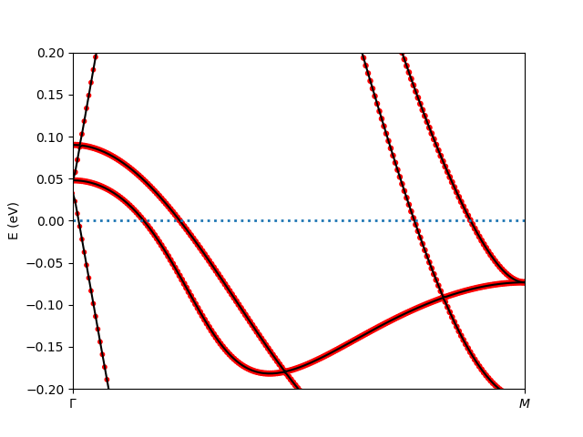

LQSGW+GRISB calculation of FeSe
-------------------------------
In this example, we illustrate how to perform LQSGW+GRISB calculation of FeSe.

LQSGW calculation of FeSe
=========================
For convenience, we prepared the input file *ini* for LQSGW calculation 
in the folder *lqsgw*. 
Starting with folder *4_FeSe*, 
One could calculate by typing the following command 
or prepare your job file accordingly and submit::

    $ cd lqsgw && mpirun -np 128 ${COMRISB_BIN}/rspflapw.exe && cd ..

Change the number of cores for parallelization as available.
The calculation is nevertheless time-consuming 
and the resulting data file is several GB. 
For convenience, the results have been precalculated 
and can be downloaded `here <https://www.dropbox.com/s/x9oz9kd6m3bh6e2/lqsgw_fese.tar.gz?dl=0>`_. 
If you choose to download the precalculated results, 
please move the downloaded file *lqsgw_fese.tar.gz* 
to the current folder *4_FeSe* and type::

    $ tar -xzf lqsgw_fese.tar.gz

This should create the file *lqsgw* with calculation results inside. 

LQSGW+GRISB calculation of FeSe
===============================
The following LQSGW+GRISB calculation steps 
resemble the DFT+GRISB calculations.
Type::

    $ mkdir -p lqsgw_risb/u5j0.8/lowh && cp fese.cif lqsgw_risb/u5j0.8/lowh/. && cd lqsgw_risb/u5j0.8/lowh
    $ ${COMRISB_BIN}/init_grisb.py -u eV -s 1

Make the choices as follows::

 structure info read from fese.cif.
 
 User inputs to initialize G-RISB simulation.
 [?] Break spin-symmetry: no
  > no
    yes
 
 [?] Break orbital-symmetry: crystal field effect
    no
  > crystal field effect
    full symmetry breaking
 
 [?] Include spin-orbit coupling: no
  > no
    yes
 
 [?] Parametrize Coulomb-matrix: Slater-Condo with [U,J]
  > Slater-Condo with [U,J]
    Slater-Condo with [F0,F2,...]
    Kanamori with [U,J]
    Manual input
 
 [?] Coulomb double counting: Fix dc potential
    FLL dc (updated at charge iter., Rec.)
  > Fix dc potential
    FLL dc self-consistent
    No dc
 
 [?] Solution of embedding Hamiltonian: VTED with Sz symmetry
    Valence truncation ED (VTED)
  > VTED with Sz symmetry
    VTED with S=0
    VTED with Jz symmetry
    ML (kernel-ridge)
    ML (normal-mode-1d)
    DMGR (expt.)
    ML (normal-mode-2d)
    ML (normal-mode-3d)
    HF (debugging only)
 
 Equivalent atom indices:
     [0 0 0 1 1] means 0-2 and 3-4 are two sets of eq. atms.
 [?] Equivalent atom indices: [0, 0, 2, 2]
  > [0, 0, 2, 2]
    modify
 
 
  ------------
  atom 0 Fe
 [?] Is this atom correlated (Y/n):
 [?] Correlated orbital: d
    s
    p
  > d
    f
 
 [?] Enter U J(sep. by space, eV): 5 0.8
 [?] Enter d electron number: 6
 
  ------------
  atom 2 Se
 [?] Is this atom correlated (Y/n): n
 
 n_symm_ops = 8 from point-group analysis
            = 8 after screening.
 correlated atom 0 with point group: D2d.
 n_symm_ops = 8 from point-group analysis
            = 8 after screening.
 correlated atom 1 with point group: D2d.
 chi_space 0: 1 equivalent ireps
               (5, 1) basis vectors.
 chi_space 1: 1 equivalent ireps
               (5, 1) basis vectors.
 chi_space 2: 1 equivalent ireps
               (5, 2) basis vectors.
 chi_space 3: 1 equivalent ireps
               (5, 1) basis vectors.

Different than DFT+GRISB calculations of Fe, 
we choose fixed double counting potential with nominal 6 `d`-electrons.
The lower site symmetry *D2d* introduces more splittings 
among the `3d` orbitals.
The symbolic matrix for local self-energy structure becomes::

 HDF5 "GParam.h5" {
 DATASET "/impurity_0/symbol_matrix" {
    DATATYPE  H5T_STD_I64LE
    DATASPACE  SIMPLE { ( 10, 10 ) / ( 10, 10 ) }
    DATA {
    (0,0): 1, 0, 0, 0, 0, 0, 0, 0, 0, 0,
    (1,0): 0, 1, 0, 0, 0, 0, 0, 0, 0, 0,
    (2,0): 0, 0, 2, 0, 0, 0, 0, 0, 0, 0,
    (3,0): 0, 0, 0, 2, 0, 0, 0, 0, 0, 0,
    (4,0): 0, 0, 0, 0, 3, 0, 0, 0, 0, 0,
    (5,0): 0, 0, 0, 0, 0, 3, 0, 0, 0, 0,
    (6,0): 0, 0, 0, 0, 0, 0, 3, 0, 0, 0,
    (7,0): 0, 0, 0, 0, 0, 0, 0, 3, 0, 0,
    (8,0): 0, 0, 0, 0, 0, 0, 0, 0, 4, 0,
    (9,0): 0, 0, 0, 0, 0, 0, 0, 0, 0, 4
    }
 }
 }

The *comrisb.ini* file is slightly modfied for LQSGW+GRISB calculation, 
which now reads::

 control={
         'initial_lattice_dir': '../../lqsgw/',
         'method': 'lqsgw+risb',
         'mpi_prefix': "mpirun -np 8",
         'impurity_problem': [[1, 'd']],
         'impurity_problem_equivalence': [1],
         }
 
 wan_hmat={
         'froz_win_min': -10.0,
         'froz_win_max': 10.0,
         }

The LQSGW+GRISB calculation is triggered in the same way as before::

 $ cd ..  # up to u5j0.8 folder
 $ python3.7 ${COMRISB_BIN}/comrisb.py -c 

Currently, the calculation finishes in one shot, 
which means the feedback from GRISB to LQSGW calculation 
is not available.
The orbital occupation matrix can be located in *lowh/Gutz.log*::

 ************    ncp-renorm  ************
 imp=  1
 real part
   0.6184   0.0000   0.0000   0.0000   0.0000   0.0000   0.0000   0.0000   0.0000   0.0000
   0.0000   0.6184   0.0000   0.0000   0.0000   0.0000   0.0000   0.0000   0.0000   0.0000
   0.0000   0.0000   0.7326   0.0000   0.0000   0.0000   0.0000   0.0000   0.0000   0.0000
   0.0000   0.0000   0.0000   0.7326   0.0000   0.0000   0.0000   0.0000   0.0000   0.0000
   0.0000   0.0000   0.0000   0.0000   0.5720   0.0000   0.0000   0.0000   0.0000   0.0000
   0.0000   0.0000   0.0000   0.0000   0.0000   0.5720   0.0000   0.0000   0.0000   0.0000
   0.0000   0.0000   0.0000   0.0000   0.0000   0.0000   0.5720   0.0000   0.0000   0.0000
   0.0000   0.0000   0.0000   0.0000   0.0000   0.0000   0.0000   0.5720   0.0000   0.0000
   0.0000   0.0000   0.0000   0.0000   0.0000   0.0000   0.0000   0.0000   0.6507   0.0000
   0.0000   0.0000   0.0000   0.0000   0.0000   0.0000   0.0000   0.0000   0.0000   0.6507
   sub_tot=  6.291317  0.000000

The kinetic energy renormalization matrix `R` at GRISB level is given as::

 ************     z-out-sym  ************
 imp=  1
 real part
   0.8515   0.0000   0.0000   0.0000   0.0000   0.0000   0.0000   0.0000   0.0000   0.0000
   0.0000   0.8515   0.0000   0.0000   0.0000   0.0000   0.0000   0.0000   0.0000   0.0000
   0.0000   0.0000   0.8480   0.0000   0.0000   0.0000   0.0000   0.0000   0.0000   0.0000
   0.0000   0.0000   0.0000   0.8480   0.0000   0.0000   0.0000   0.0000   0.0000   0.0000
   0.0000   0.0000   0.0000   0.0000   0.8314   0.0000   0.0000   0.0000   0.0000   0.0000
   0.0000   0.0000   0.0000   0.0000   0.0000   0.8314   0.0000   0.0000   0.0000   0.0000
   0.0000   0.0000   0.0000   0.0000   0.0000   0.0000   0.8314   0.0000   0.0000   0.0000
   0.0000   0.0000   0.0000   0.0000   0.0000   0.0000   0.0000   0.8314   0.0000   0.0000
   0.0000   0.0000   0.0000   0.0000   0.0000   0.0000   0.0000   0.0000   0.8130   0.0000
   0.0000   0.0000   0.0000   0.0000   0.0000   0.0000   0.0000   0.0000   0.0000   0.8130

One can view the band structure in a fine energy window near Fermi level 
by typing::

    $ cd lowh && ${COMRISB_BIN}/plot_band_tf.py -el -0.2 -eh 0.2 && cd ..

It generates the following band structure decorated with `3d`-orbital weights.

This concludes the tutorial of ComRISB.
